# KSC AIBox 一体机 - 完整架构原理图

> 基于169GB安装包完全解压后的102个配置文件深度分析
> 绘制时间: 2026-04-09
> 版本: ytj-install-3.7.0-arm64-AI_910B-20260408-126

---

## 一、系统整体架构原理图

```mermaid
graph TB
    subgraph "用户访问层 User Access Layer"
        User1[👤 用户浏览器]
        User2[👤 办公人员]
        User3[👤 管理员]
    end

    subgraph "Web前端层 Web Frontend Layer [端口: 30080]"
        Nginx[🌐 weboffice-nginx<br/>80/443 NodePort]
        PLSSWeb[🖥️ plss-web<br/>前端UI界面]
        WPSWord[📝 webword<br/>Word在线编辑]
        WPSExcel[📊 webet<br/>Excel在线编辑]
        WPSppt[📽️ webwpp<br/>PPT在线编辑]
        WPSPDF[📄 webpdf<br/>PDF查看器]
    end

    subgraph "API网关层 API Gateway Layer [端口: 8064]"
        Gateway[🚪 plss-gateway<br/>统一API入口<br/>端口:8064]
    end

    subgraph "微服务层 Microservices Layer [namespace: middle]"
        SystemServer[⚙️ plss-system-server<br/>系统管理:8061]
        OpenServer[🔓 plss-open-server<br/>开放API]
        DocProcess[📋 plss-document-process<br/>文档处理]
        RecordServer[📝 plss-record-server<br/>记录服务]
        SearchServer[🔍 plss-search-server<br/>搜索服务<br/>/data/app/ofd2json]
        PluginServer[🔌 plss-plugin-server<br/>插件服务]
        NLPDraft[✍️ plss-nlp-draft<br/>NLP起草]
        NLPApp[🎯 nlp-application<br/>NLP应用]
        NLPIntegration[🔗 nlp-capacity-integration<br/>NLP集成:8086]
        AIAPI[🤖 ai-qingqiu-13b-api<br/>AI网关:8000]
        OCR[👁️ ocr-ss<br/>OCR识别]
        Convert[🔄 convert-edms<br/>文档转换]
        ReaderSvc[📖 reader-svc<br/>阅读服务]
    end

    subgraph "AI推理层 AI Inference Layer [NPU加速]"
        Qwen13B[🧠 qingqiu-qwen3<br/>13B模型:1025<br/>NPU 0<br/>40Gi PVC]
        Qwen4B[🧠 qwen4b<br/>4B模型<br/>NPU 1]
        Emb[📐 emb<br/>Embedding<br/>NPU 2]
        Reranker[📊 reranker<br/>重排序<br/>NPU 3]
    end

    subgraph "配置中心层 Configuration Layer"
        Nacos[⚙️ Nacos配置中心<br/>8848/9848/9849<br/>NodePort:38848<br/>10Gi PVC]
        Etcd[📦 etcd分布式KV<br/>2379<br/>20Gi PVC<br/>WPS配置中心]
        ConfigMap[🔐 ConfigMap密钥<br/>configkey/secretkey<br/>apollo/athena]
    end

    subgraph "中间件层 Middleware Layer [namespace: middle]"
        PostgreSQL[🐘 PostgreSQL<br/>5432<br/>10Gi PVC<br/>plss数据库]
        MySQL[🐬 MySQL<br/>3306<br/>20Gi PVC<br/>wps数据库]
        Redis[⚡ Redis缓存<br/>6379<br/>10Gi PVC]
        ES[🔎 Elasticsearch<br/>9200/9300<br/>100Gi×3 PVC<br/>3节点集群]
        MinIO[💾 MinIO对象存储<br/>9000/9090<br/>10Gi PVC]
        Neo4j[🕸️ Neo4j图数据库<br/>7474/7687<br/>5Gi PVC]
        RabbitMQ[🐰 RabbitMQ消息队列<br/>5672/15672<br/>10Gi PVC]
        SLC[🔒 SLC授权服务<br/>9521<br/>10Gi PVC<br/>NodePort:39521]
    end

    subgraph "持久化存储层 Persistent Storage Layer"
        CephRBD[(🗄️ Ceph RBD<br/>csi-rbd-sc<br/>~355Gi总容量)]
        HostPath[(💿 HostPath本地存储<br/>/data/app/*<br/>/data/weboffice/*<br/>/data/AI/*)]
    end

    subgraph "硬件加速层 Hardware Acceleration Layer"
        NPU0[⚡ NPU 0<br/>昇腾910B<br/>64GB HBM<br/>qingqiu-qwen3]
        NPU1[⚡ NPU 1<br/>昇腾910B<br/>64GB HBM<br/>qwen4b]
        NPU2[⚡ NPU 2<br/>昇腾910B<br/>64GB HBM<br/>emb]
        NPU3[⚡ NPU 3<br/>昇腾910B<br/>64GB HBM<br/>reranker]
    end

    subgraph "容器编排层 Container Orchestration"
        K3s[☸️ K3s容器编排<br/>已运行]
        Harbor[📦 Harbor镜像仓库<br/>hub.ai.aio.cloud<br/>已运行]
    end

    %% 用户访问流向
    User1 --> Nginx
    User2 --> Nginx
    User3 --> PLSSWeb
    
    %% Web前端流向
    Nginx --> PLSSWeb
    Nginx --> WPSWord
    Nginx --> WPSExcel
    Nginx --> WPSppt
    Nginx --> WPSPDF
    
    PLSSWeb --> Gateway
    WPSWord --> Etcd
    WPSExcel --> Etcd
    WPSppt --> Etcd
    WPSPDF --> Etcd
    
    %% API网关流向
    Gateway --> SystemServer
    Gateway --> OpenServer
    Gateway --> DocProcess
    Gateway --> SearchServer
    Gateway --> AIAPI
    
    %% 微服务内部调用
    DocProcess --> SearchServer
    SearchServer --> ES
    AIAPI --> NLPIntegration
    NLPIntegration --> Qwen13B
    AIAPI --> Qwen13B
    
    %% AI推理流向
    Qwen13B -.使用.-> NPU0
    Qwen4B -.使用.-> NPU1
    Emb -.使用.-> NPU2
    Reranker -.使用.-> NPU3
    
    %% 微服务依赖中间件
    SystemServer --> Nacos
    OpenServer --> Nacos
    DocProcess --> Nacos
    Gateway --> Nacos
    AIAPI --> Nacos
    
    %% 数据库依赖
    SystemServer --> PostgreSQL
    DocProcess --> PostgreSQL
    SearchServer --> PostgreSQL
    OpenServer --> MySQL
    WPSWord --> MySQL
    WPSExcel --> MySQL
    
    %% 缓存依赖
    SystemServer --> Redis
    Gateway --> Redis
    Etcd -.配置.-> Redis
    
    %% 对象存储依赖
    DocProcess --> MinIO
    SearchServer --> MinIO
    Etcd -.配置.-> MinIO
    
    %% 知识图谱
    SearchServer --> Neo4j
    
    %% 消息队列
    DocProcess -.异步.-> RabbitMQ
    
    %% 授权服务
    Nginx -.授权检查.-> SLC
    
    %% 配置中心依赖
    Nacos -.管理.-> SystemServer
    Nacos -.管理.-> Gateway
    Nacos -.管理.-> OpenServer
    Etcd -.配置.-> WPSWord
    Etcd -.配置.-> WPSExcel
    ConfigMap -.密钥.-> Gateway
    ConfigMap -.密钥.-> AIAPI
    
    %% 存储层
    PostgreSQL -.PVC.-> CephRBD
    MySQL -.PVC.-> CephRBD
    Redis -.PVC.-> CephRBD
    Nacos -.PVC.-> CephRBD
    ES -.PVC.-> CephRBD
    MinIO -.PVC.-> CephRBD
    Neo4j -.PVC.-> CephRBD
    RabbitMQ -.PVC.-> CephRBD
    Etcd -.PVC.-> CephRBD
    SLC -.PVC.-> CephRBD
    Qwen13B -.PVC.-> CephRBD
    
    SearchServer -.HostPath.-> HostPath
    NLPIntegration -.HostPath.-> HostPath
    PLSSWeb -.HostPath.-> HostPath
    
    %% 容器编排
    K3s -.管理.-> Nginx
    K3s -.管理.-> Gateway
    K3s -.管理.-> SystemServer
    K3s -.管理.-> PostgreSQL
    K3s -.管理.-> Qwen13B
    Harbor -.提供镜像.-> K3s

    classDef userLayer fill:#E1F5FE,stroke:#01579B,stroke-width:2px
    classDef webLayer fill:#E8F5E9,stroke:#1B5E20,stroke-width:2px
    classDef gatewayLayer fill:#FFF3E0,stroke:#E65100,stroke-width:2px
    classDef microserviceLayer fill:#F3E5F5,stroke:#4A148C,stroke-width:2px
    classDef aiLayer fill:#FFEBEE,stroke:#B71C1C,stroke-width:2px
    classDef configLayer fill:#FFFDE7,stroke:#F57F17,stroke-width:2px
    classDef middlewareLayer fill:#E0F2F1,stroke:#004D40,stroke-width:2px
    classDef storageLayer fill:#F5F5F5,stroke:#212121,stroke-width:2px
    classDef hardwareLayer fill:#FFCDD2,stroke:#C62828,stroke-width:2px
    classDef orchestrationLayer fill:#E8EAF6,stroke:#1A237E,stroke-width:2px

    class User1,User2,User3 userLayer
    class Nginx,PLSSWeb,WPSWord,WPSExcel,WPSppt,WPSPDF webLayer
    class Gateway gatewayLayer
    class SystemServer,OpenServer,DocProcess,RecordServer,SearchServer,PluginServer,NLPDraft,NLPApp,NLPIntegration,AIAPI,OCR,Convert,ReaderSvc microserviceLayer
    class Qwen13B,Qwen4B,Emb,Reranker aiLayer
    class Nacos,Etcd,ConfigMap configLayer
    class PostgreSQL,MySQL,Redis,ES,MinIO,Neo4j,RabbitMQ,SLC middlewareLayer
    class CephRBD,HostPath storageLayer
    class NPU0,NPU1,NPU2,NPU3 hardwareLayer
    class K3s,Harbor orchestrationLayer
```

---

## 二、数据流向详细图

### 2.1 用户文档处理流程

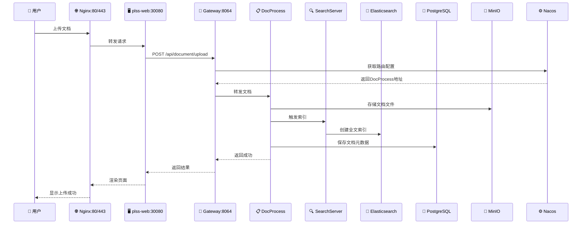

### 2.2 AI对话流程

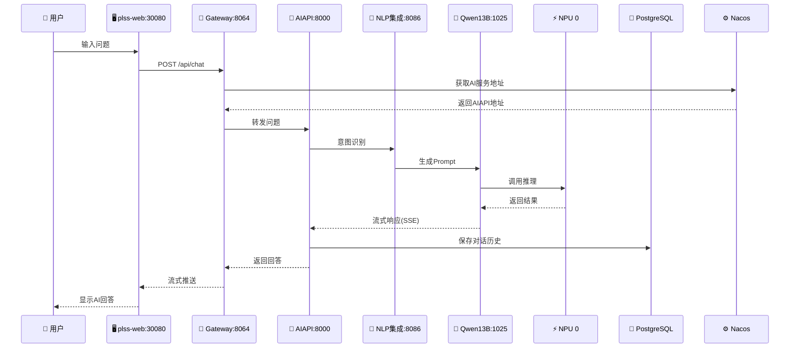

### 2.3 WPS在线编辑流程

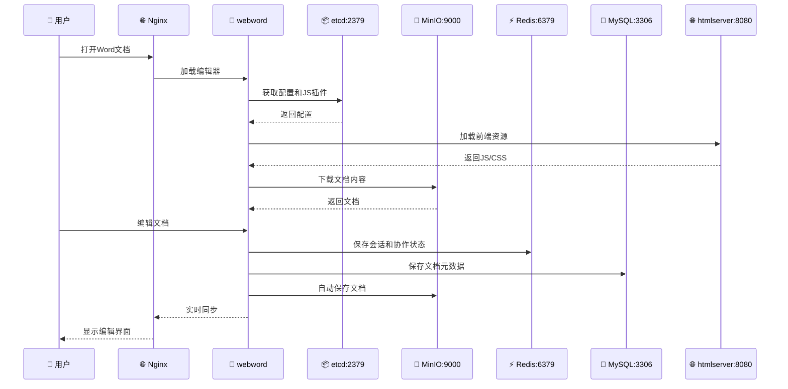

---

## 三、配置管理中心架构图

```mermaid
graph TB
    subgraph "Nacos配置中心"
        NacosUI[Nacos控制台<br/>8848]
        NacosConfig[微服务配置]
        NacosDB[数据库连接配置]
        NacosAuth[认证配置]
        NacosFeature[功能开关]
    end

    subgraph "etcd配置中心 (WPS专用)"
        EtcdUI[etcdctl]
        EtcdWPS[WPS Office配置]
        EtcdRedis[Redis连接配置]
        EtcdMinIO[MinIO存储配置]
        EtcdMySQL[MySQL连接配置]
        EtcdJS[JS插件配置]
        EtcdLang[多语言配置]
    end

    subgraph "K8s ConfigMap"
        CM1[configkey<br/>2d61e84b...]
        CM2[secretkey<br/>60f27975...]
        CM3[apollo<br/>a63aed13...]
        CM4[athena<br/>aef9a1f0...]
    end

    subgraph "使用方"
        Gateway[plss-gateway]
        SystemServer[plss-system-server]
        AIAPI[ai-qingqiu-13b-api]
        WebWord[webword]
        WebExcel[webet]
    end

    NacosConfig --> Gateway
    NacosConfig --> SystemServer
    NacosDB --> Gateway
    NacosAuth --> Gateway
    NacosFeature --> SystemServer

    EtcdWPS --> WebWord
    EtcdWPS --> WebExcel
    EtcdRedis --> WebWord
    EtcdMinIO --> WebWord
    EtcdJS --> WebWord
    EtcdLang --> WebWord

    CM1 -.挂载.-> Gateway
    CM2 -.挂载.-> Gateway
    CM3 -.挂载.-> AIAPI
    CM4 -.挂载.-> AIAPI

    classDef nacos fill:#FFF9C4,stroke:#F57F17,stroke-width:2px
    classDef etcd fill:#C8E6C9,stroke:#1B5E20,stroke-width:2px
    classDef cm fill:#BBDEFB,stroke:#0D47A1,stroke-width:2px
    classDef user fill:#F3E5F5,stroke:#4A148C,stroke-width:2px

    class NacosUI,NacosConfig,NacosDB,NacosAuth,NacosFeature nacos
    class EtcdUI,EtcdWPS,EtcdRedis,EtcdMinIO,EtcdMySQL,EtcdJS,EtcdLang etcd
    class CM1,CM2,CM3,CM4 cm
    class Gateway,SystemServer,AIAPI,WebWord,WebExcel user
```

---

## 四、存储架构详图

```mermaid
graph TB
    subgraph "Ceph RBD分布式存储 [csi-rbd-sc]"
        CephCluster[(🗄️ Ceph集群)]
        
        subgraph "PVC分配 (~355Gi)"
            PVC_PG[PostgreSQL PVC<br/>10Gi]
            PVC_MySQL[MySQL PVC<br/>20Gi]
            PVC_Redis[Redis PVC<br/>10Gi]
            PVC_Nacos[Nacos PVC<br/>10Gi]
            PVC_ES1[ES PVC Node1<br/>100Gi]
            PVC_ES2[ES PVC Node2<br/>100Gi]
            PVC_ES3[ES PVC Node3<br/>100Gi]
            PVC_MinIO[MinIO PVC<br/>10Gi]
            PVC_Neo4j[Neo4j PVC<br/>5Gi]
            PVC_RabbitMQ[RabbitMQ PVC<br/>10Gi]
            PVC_Etcd[etcd PVC<br/>20Gi]
            PVC_SLC[SLC PVC<br/>10Gi]
            PVC_Qwen[Qwen13B PVC<br/>40Gi]
        end
        
        CephCluster --> PVC_PG
        CephCluster --> PVC_MySQL
        CephCluster --> PVC_Redis
        CephCluster --> PVC_Nacos
        CephCluster --> PVC_ES1
        CephCluster --> PVC_ES2
        CephCluster --> PVC_ES3
        CephCluster --> PVC_MinIO
        CephCluster --> PVC_Neo4j
        CephCluster --> PVC_RabbitMQ
        CephCluster --> PVC_Etcd
        CephCluster --> PVC_SLC
        CephCluster --> PVC_Qwen
    end

    subgraph "HostPath本地存储"
        subgraph "/data/app/ [应用数据]"
            HP_Logs[logs/<br/>应用日志 777]
            HP_Import[import/<br/>数据导入 777]
            HP_NLP[nlp-capacity-integration/<br/>NLP集成 777]
            HP_OFD[ofd2json/<br/>OFD转换 777]
            HP_HTML[html/<br/>前端静态文件 777]
        end
        
        subgraph "/data/weboffice/ [WPS数据]"
            HP_WPSLog[log/<br/>WPS日志 777]
            HP_WPSHTML[html/<br/>WPS插件 777]
        end
        
        subgraph "/data/AI/ [AI模型]"
            HP_Model[qingqiu-Qwen3-13b-base/<br/>模型备份]
            HP_ModelBak[qingqiu-Qwen3-13b-base-bak/<br/>模型备份]
        end
        
        subgraph "/slc/data/ [授权数据]"
            HP_SLC[slc/data/<br/>SLC授权]
        end
    end

    PVC_PG --> PG[(PostgreSQL<br/>数据库文件)]
    PVC_MySQL --> MySQL[(MySQL<br/>数据库文件)]
    PVC_ES1 --> ES_Data1[(ES索引数据)]
    PVC_MinIO --> MinIO_Data[(对象存储数据)]
    
    HP_Logs --> App1[plss-gateway日志]
    HP_Logs --> App2[plss-system日志]
    HP_NLP --> NLPData[NLP集成数据]
    HP_OFD --> OFDData[OFD转换数据]
    HP_HTML --> WebData[前端静态文件]
    HP_Model --> ModelBackup[AI模型备份]

    classDef ceph fill:#E1BEE7,stroke:#6A1B9A,stroke-width:2px
    classDef hostpath fill:#FFE0B2,stroke:#E65100,stroke-width:2px
    classDef pvc fill:#BBDEFB,stroke:#1565C0,stroke-width:2px

    class CephCluster ceph
    class PVC_PG,PVC_MySQL,PVC_Redis,PVC_Nacos,PVC_ES1,PVC_ES2,PVC_ES3,PVC_MinIO,PVC_Neo4j,PVC_RabbitMQ,PVC_Etcd,PVC_SLC,PVC_Qwen pvc
    class HP_Logs,HP_Import,HP_NLP,HP_OFD,HP_HTML,HP_WPSLog,HP_WPSHTML,HP_Model,HP_ModelBak,HP_SLC hostpath
```

---

## 五、NPU资源分配图

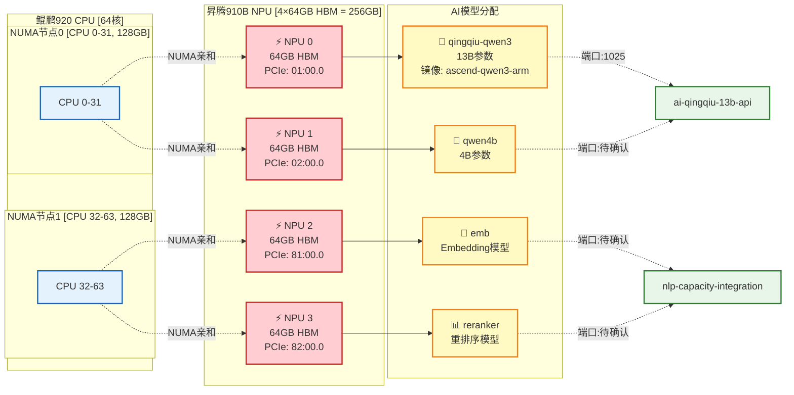

---

## 六、镜像管理流程图

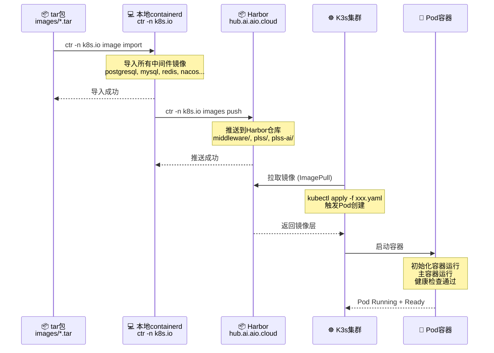

---

## 七、安装部署流程图

```mermaid
graph TB
    Start([🚀 开始安装]) --> Check{检查环境}
    
    Check -->|K3s已运行| Step1
    Check -->|Harbor已运行| Step1
    Check -->|NPU驱动正常| Step1
    Check -->|存储充足| Step1
    
    Step1[📋 步骤1: 安装中间件<br/>bash install-middle.sh] --> Middle1[创建Harbor项目<br/>middleware/plss/weboffice/plss-ai]
    Middle1 --> Middle2[导入镜像到containerd]
    Middle2 --> Middle3[推送镜像到Harbor]
    Middle3 --> Middle4[kubectl apply创建资源]
    Middle4 --> Middle5[执行SQL初始化]
    Middle5 --> Middle6[导入Nacos配置]
    Middle6 --> Middle7[等待所有Pod Running]
    
    Middle7 --> Step2[📋 步骤2: 安装WPS Office<br/>bash install-weboffice.sh]
    Step2 --> WPS1[导入WPS镜像]
    WPS1 --> WPS2[初始化日志目录<br/>/data/weboffice/log]
    WPS2 --> WPS3[初始化插件目录<br/>/data/weboffice/html]
    WPS3 --> WPS4[替换plugin.js变量]
    WPS4 --> WPS5[kubectl apply WPS资源]
    WPS5 --> WPS6[等待WPS Pod Running]
    
    WPS6 --> Step3[📋 步骤3: 安装应用服务<br/>bash install-app.sh]
    Step3 --> App1[应用ConfigMap<br/>configkey/secretkey]
    App1 --> App2[初始化应用目录<br/>/data/app/logs /import]
    App2 --> App3[特殊初始化<br/>NLP/Web/Reader/OFD]
    App3 --> App4[导入应用镜像]
    App4 --> App5[kubectl apply应用资源]
    App5 --> App6[等待所有Pod Running]
    
    App6 --> Step4[📋 步骤4: 安装AI模型<br/>bash install-AI.sh]
    Step4 --> AI1[解压模型tar到/data/AI]
    AI1 --> AI2[导入AI镜像]
    AI2 --> AI3[kubectl create AI资源]
    AI3 --> AI4[等待AI Pod Running]
    AI5{检查NPU状态}
    
    AI4 --> AI5
    AI5 -->|4张NPU正常| Verify[✅ 安装验证]
    AI5 -->|NPU异常| Fix[🔧 故障排查]
    Fix --> AI5
    
    Verify --> Test1[测试数据库连接]
    Test1 --> Test2[测试Nacos访问]
    Test2 --> Test3[测试AI推理]
    Test3 --> Test4[测试WPS编辑]
    Test4 --> Test5[测试全文检索]
    Test5 --> End([🎉 安装完成])

    classDef step fill:#E3F2FD,stroke:#1565C0,stroke-width:3px
    classDef middle fill:#E8F5E9,stroke:#2E7D32,stroke-width:2px
    classDef wps fill:#FFF9C4,stroke:#F57F17,stroke-width:2px
    classDef app fill:#F3E5F5,stroke:#4A148C,stroke-width:2px
    classDef ai fill:#FFEBEE,stroke:#C62828,stroke-width:2px
    classDef verify fill:#E0F2F1,stroke:#00695C,stroke-width:2px

    class Step1,Middle1,Middle2,Middle3,Middle4,Middle5,Middle6,Middle7 middle
    class Step2,WPS1,WPS2,WPS3,WPS4,WPS5,WPS6 wps
    class Step3,App1,App2,App3,App4,App5,App6 app
    class Step4,AI1,AI2,AI3,AI4,AI5 ai
    class Verify,Test1,Test2,Test3,Test4,Test5 verify
```

---

## 八、微服务依赖关系矩阵

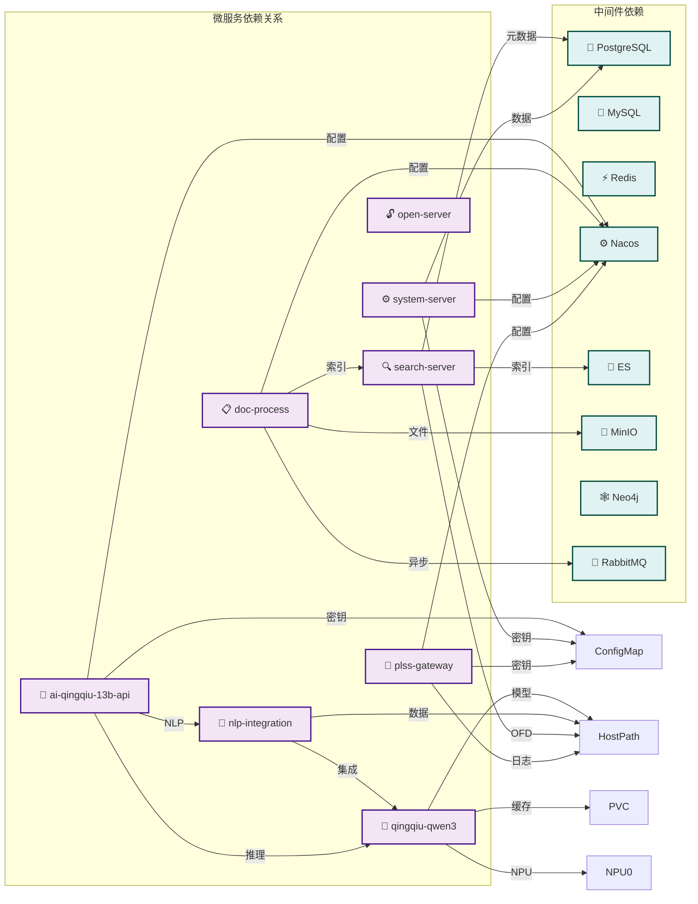

---

## 九、端口总览图

```mermaid
graph TB
    subgraph "用户访问端口"
        Port30080[30080 - plss-web前端]
        Port80[80 - WPS Nginx]
        Port443[443 - WPS Nginx HTTPS]
    end

    subgraph "API网关端口"
        Port8064[8064 - plss-gateway]
        Port8061[8061 - system-server]
    end

    subgraph "AI服务端口"
        Port8000[8000 - ai-qingqiu-13b-api]
        Port1025[1025 - qingqiu-qwen3]
        Port8086[8086 - nlp-integration]
    end

    subgraph "中间件端口"
        Port5432[5432 - PostgreSQL]
        Port3306[3306 - MySQL]
        Port6379[6379 - Redis]
        Port8848[8848 - Nacos HTTP]
        Port9848[9848 - Nacos gRPC]
        Port9200[9200 - Elasticsearch]
        Port9000[9000 - MinIO API]
        Port9090[9090 - MinIO Console]
        Port7687[7687 - Neo4j Bolt]
        Port5672[5672 - RabbitMQ AMQP]
        Port2379[2379 - etcd]
        Port9521[9521 - SLC授权]
    end

    subgraph "NodePort端口"
        NP38848[38848 - Nacos]
        NP39521[39521 - SLC]
    end

    User --> Port30080
    User --> Port80
    User --> Port443
    
    Port30080 --> Port8064
    Port8064 --> Port8061
    Port8064 --> Port8000
    Port8000 --> Port1025
    Port8000 --> Port8086
    
    Port8064 --> Port5432
    Port8064 --> Port3306
    Port8064 --> Port6379
    Port8064 --> Port8848
    Port8064 --> Port9200
    Port8064 --> Port9000
    Port8064 --> Port7687
    Port8064 --> Port5672
    Port8064 --> Port2379
    Port80 --> Port9521

    classDef userPort fill:#E1F5FE,stroke:#01579B,stroke-width:2px
    classDef apiPort fill:#FFF3E0,stroke:#E65100,stroke-width:2px
    classDef aiPort fill:#FFEBEE,stroke:#B71C1C,stroke-width:2px
    classDef middlewarePort fill:#E0F2F1,stroke:#004D40,stroke-width:2px
    classDef nodePort fill:#F3E5F5,stroke:#4A148C,stroke-width:2px

    class Port30080,Port80,Port443 userPort
    class Port8064,Port8061 apiPort
    class Port8000,Port1025,Port8086 aiPort
    class Port5432,Port3306,Port6379,Port8848,Port9848,Port9200,Port9000,Port9090,Port7687,Port5672,Port2379,Port9521 middlewarePort
    class NP38848,NP39521 nodePort
```

---

## 十、系统资源需求汇总

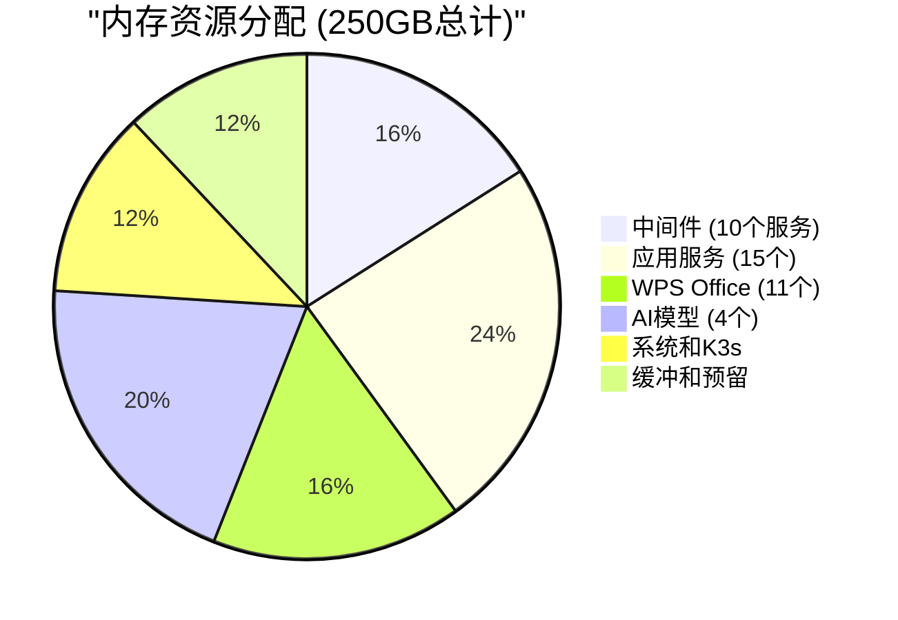

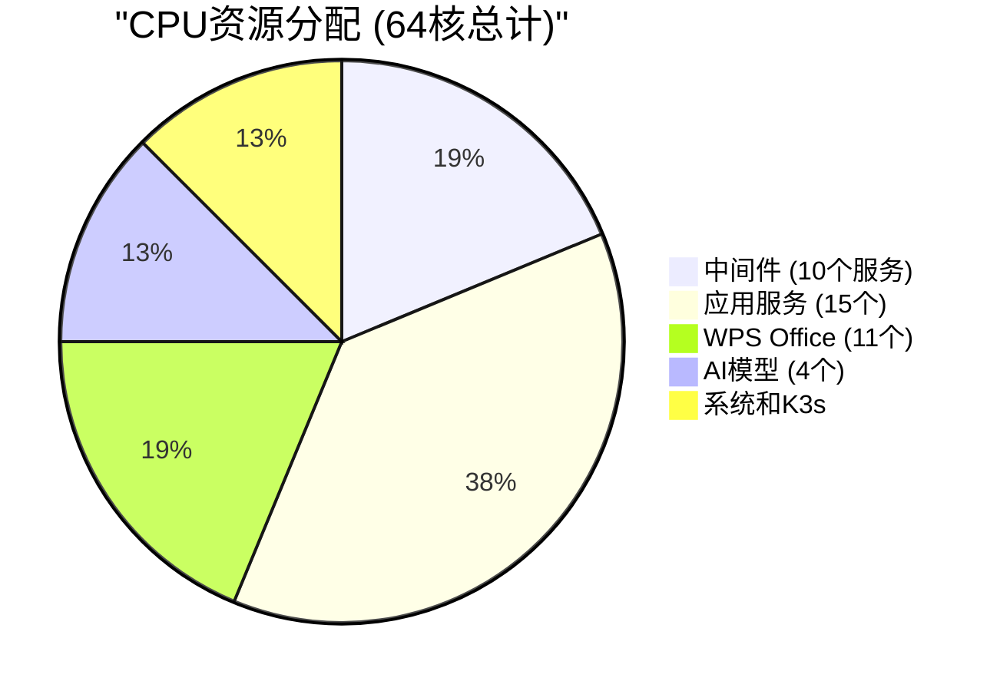

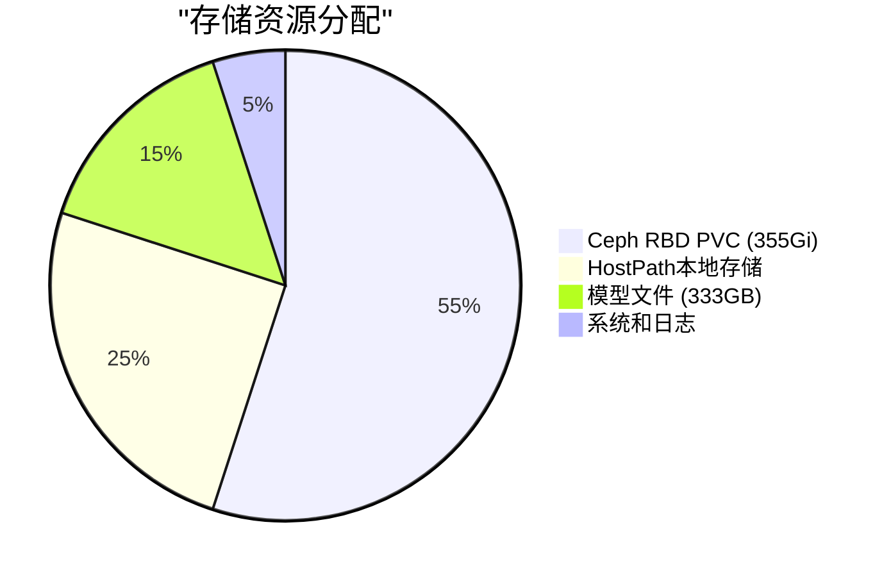

---

*架构图生成时间: 2026-04-09*
*基于102个配置文件深度分析*
*维护团队: KSC AIBox Team*
